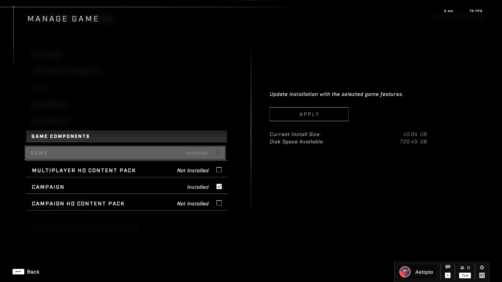

## Pre-Setup
### Ensure you have done the following before beginning this guide.
1. Uninstall High Resolution Textures.
   ### Ingame:  
   

   ### Steam:
   
2. Using the lowest settings in Halo Infinite.             
   Additionally having any visual effects disabled.

   Sensory [`Sharpening is optional but set it max if using the lowest resolution scale.`]:
   

   UI Visual Effects:         
   

   Visual:   
   

3. Graphics Control Panel Setup                  
   Depending on your GPU (NVIDIA/AMD) make sure it is set to maximum performance.      
   Use the latest available driver for your GPU. [Refer here](https://support.halowaypoint.com/hc/en-us/articles/4408731548180-PC-hardware-specs-and-drivers-for-Halo-Infinite)       
   Optionally feel free to enable `Threaded Optimizations` or `Low Latency Mode` in the NVIDIA Control Panel.

4. Application Properties           
   Applying the following application properties might also help:
                                   
    

    Try each setting shown here and see if improves performance.
    **Disabling Fullscreen Optimizations is recommended!** 

5. Additional Stuff
   1. Enable the High Performance power plan.
   2. Disable the Game Bar.
   3. Fully update Windows 10/11.